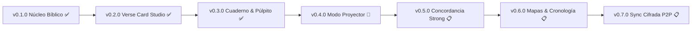

# 🗺️ Roadmap Oficial de Desarrollo — Biblia RVR 1960 Desktop
### *Una aplicación creada y diseñada por SoyJhery*
**Contacto oficial:** [soyjhery@gmail.com](mailto:soyjhery@gmail.com)  
**Copyright:** Copyright © 2026 SoyJhery. Todos los derechos reservados.

---

Este documento describe la visión de producto, los hitos alcanzados y las etapas planificadas para consolidar a **Biblia RVR 1960 Desktop** como la herramienta de estudio y ministerio más estética, confiable y rápida del ecosistema hispanohablante.

---

## 📌 Estado de Fases y Versiones

---

## ✅ Fase 1 — Núcleo Canónico & Motor de Lectura (`v0.1.0`)
*Estado: Completado y publicado.*

- [x] **Base de datos canónica 100% offline:** Inclusión íntegra de los 66 libros de la Biblia Reina-Valera 1960 (1,189 capítulos y 31,104 versículos).
- [x] **Motor de lectura adaptable:** Modos Oscuro (*Dark Slate*), Sepia/Papiro y Claro con tipografía Serif y Sans configurable.
- [x] **Navegador canónico ágil:** Selector organizado por géneros bíblicos (Pentateuco, Poéticos, Evangelios, etc.) y cuadrícula de capítulos.
- [x] **Buscador global:** Búsqueda en tiempo real insensible a tildes y mayúsculas, con filtros por testamento y libro.
- [x] **Colecciones temáticas:** Creación de carpetas de estudio (promesas, consuelo, etc.) con notas personales.
- [x] **Marcadores y Favoritos:** Guardado de puntos de lectura y versículos destacados.
- [x] **Soporte multiplataforma:** Ejecución nativa en Linux y binario portable / instalador para Windows (`.exe`).

---

## ✅ Fase 2 — Verse Card Studio HD (`v0.2.0`)
*Estado: Completado y publicado.*

- [x] **Generador de postales bíblicas HD:** Exportación de imágenes nítidas a resolución de $1080\times1080$ (cuadrado) y $1080\times1920$ (formato vertical para historias, reels y estados).
- [x] **Paletas visuales de diseño:** 6 temas prémium (*Obsidiana Dorada*, *Azul Celestial*, *Paz Esmeralda*, *Púrpura Real*, *Papiro Clásico* y *Minimalista Blanco*).
- [x] **Acciones directas:** Descarga de imagen en formato `.png` y copiado directo al portapapeles para pegar al instante en WhatsApp o Telegram.
- [x] **Firma de autoría:** Inclusión de la firma oficial de autoría `📖 Biblia RVR 1960 • Una app de SoyJhery`.

---

## ✅ Fase 3 — Cuaderno de Bosquejos WYSIWYG & Modo Púlpito (`v0.3.0`)
*Estado: Completado y publicado.*

- [x] **Cuaderno en Pantalla Dividida (*Split-View*):** Lectura bíblica a la izquierda y escritura de bosquejos a la derecha.
- [x] **Editor WYSIWYG visual:** Formato enriquecido (títulos, subtítulos, citas, listas, negritas) sin visualización de código crudo.
- [x] **Inserción de pasajes bíblicos en bloque:** Inserción limpia de versículos como tarjetas estilizadas en el cursor.
- [x] **Pasajes interactivos vinculados:** Insignias de versículos vinculados que navegan al pasaje correspondiente en la Biblia con un clic.
- [x] **Modo Púlpito para predicación:** Vista despejada, sin menús ni controles de edición, con tipografía amplia para predicar sin distracciones.
- [x] **Exportación homilética:** Exportación limpia a Markdown (`.md`), impresión formateada o guardado a PDF (`Ctrl+P`).

---

## 🚀 Fase 4 — Modo Proyector / Segunda Pantalla (`v0.4.0`)
*Estado: Próximo desarrollo.*

- [ ] **Detección multimonitor:** Reconocimiento automático de pantallas secundarias conectadas por HDMI, DisplayPort, VGA o proyectores inalámbricos.
- [ ] **Ventana independiente de proyección:** Ventana dedicada sin bordes (*borderless fullscreen*) que se proyecta en la segunda pantalla.
- [ ] **Consola de operador:** Panel de control en la pantalla principal para que el operador bíblico envíe versículos a la pantalla con un clic, mantenga una pantalla en negro (*blackout*) o con el logotipo de la iglesia.
- [ ] **Modos de visualización:**
  - Modo Versículo Completo (fondo oscuro de alto contraste y tipografía dorada/blanca ultra legible).
  - Modo Puntos del Sermón (proyección sincronizada desde el Cuaderno de Bosquejos).
  - Modo Tercio Inferior (*Lower Thirds*) para integración con transmisiones en vivo (OBS Studio / vMix).
- [ ] **Fondos dinámicos litúrgicos:** Selección de fondos sutiles y gradientes solemnes para la proyección.

---

## 📋 Fase 5 — Concordancia Strong & Referencias Cruzadas (`v0.5.0`)
*Estado: Planificado.*

- [ ] **Diccionario y números Strong:** Integración de la numeración Strong para el Antiguo Testamento (hebreo/arameo) y Nuevo Testamento (griego koine).
- [ ] **Explorador morfológico interactivo:** Al posar el cursor sobre una palabra en pasajes clave, desplegar el término original, transliteración, significado y número de apariciones.
- [ ] **Tesoro de la Escritura (Referencias Cruzadas):** Panel lateral con más de 500,000 referencias cruzadas que conectan profecías con su cumplimiento y pasajes paralelos.

---

## 📋 Fase 6 — Mapas Cartográficos & Cronología Bíblica (`v0.6.0`)
*Estado: Planificado.*

- [ ] **Atlas Bíblico Interactivo:** Mapas vectoriales de alta definición de la Geografía Bíblica:
  - Rutas de los Patriarcas (Abraham, Isaac, Jacob).
  - La ruta del Éxodo y la travesía del desierto.
  - La división territorial de las 12 tribus de Israel.
  - Los viajes misioneros del apóstol Pablo y los siete templos del Apocalipsis.
- [ ] **Línea de tiempo histórica interactiva:** Cronología comparativa desde los orígenes bíblicos, períodos de los Reyes, Exilio Babilónico y época del Segundo Templo con gobernantes y profetas contemporáneos.

---

## 📋 Fase 7 — Sincronización Cifrada Local-First & Nube P2P (`v0.7.0`)
*Estado: Planificado.*

- [ ] **Cifrado de extremo a extremo:** Protección criptográfica (AES-256) de notas personales, bosquejos homiléticos y marcadores.
- [ ] **Sincronización multi-dispositivo:** Respaldo automático a almacenamiento local externo (pendrive) o nube privada seleccionada por el usuario (WebDAV, Nextcloud o cuenta en la nube) sin intermediarios ni recopilación de datos.
- [ ] **Resolución inteligente de conflictos:** Fusión de notas modificadas en distintos equipos sin sobrescribir contenido.

---

> ### 🛑 Restricciones de Diseño y Alcance
> - **Sin audio ni síntesis de voz (TTS):** Queda permanentemente descartada la inclusión de sintetizadores de voz artificial o reproductores de audio, manteniendo la aplicación 100% enfocada en la lectura reflexiva, la preparación rigurosa y la predicación personal.
> - **Privacidad Absoluta:** 0 telemetría, 0 analíticas, 0 publicidad. La Palabra de Dios y los apuntes del usuario permanecen exclusivamente en sus propios dispositivos.
